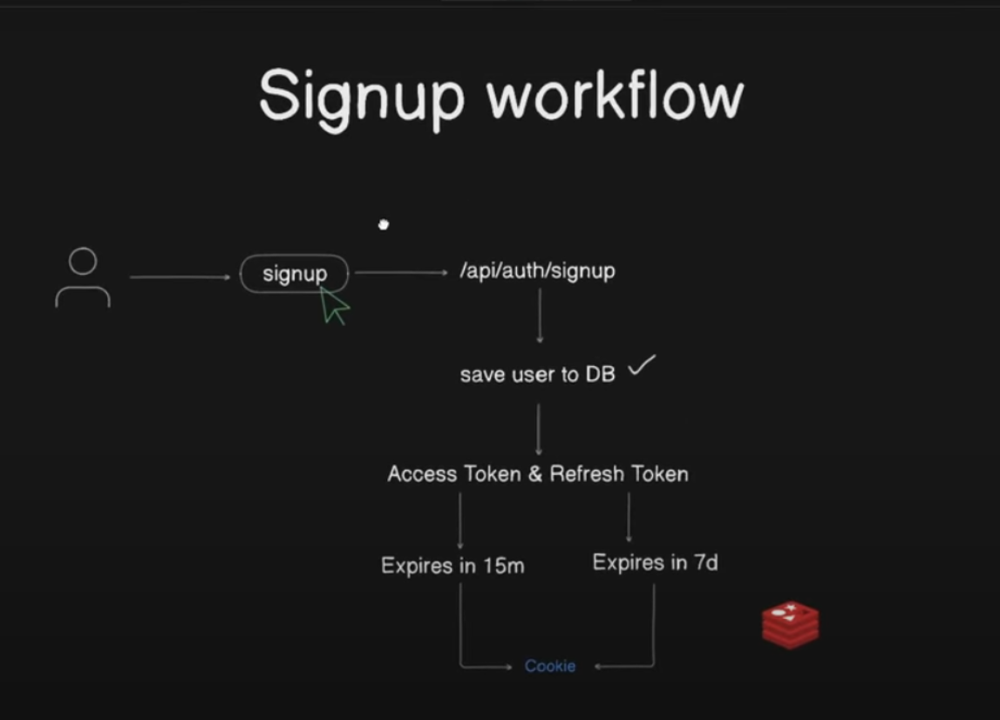

## using upstash for serverless data
- Redis is your car but upstash is like an uber
### What is Redis?
- Redis is a fast database that stores data in memory (RAM) instead of a hard drive.
- It is often used for caching, storing session data, real-time applications, etc.
- Example: You can use Redis to store user session data so your app loads faster.
### What is Upstash?
- a cloud-based (serverless) version of Redis.
- `Upstash is just Redis, but hosted online (in the cloud) and managed for you.`
- `It's called serverless because you don’t need to worry about servers,it just works when you need it.`
- It is fully managed, meaning you don’t have to set up or maintain anything.
## using cloudinary for storing images

